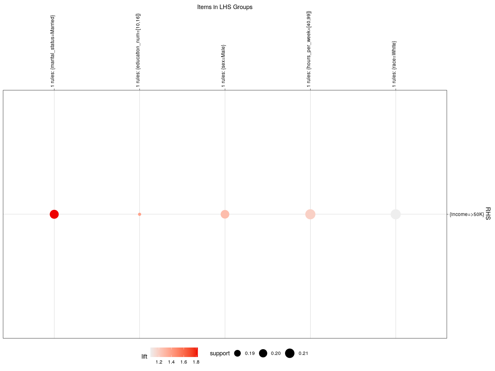
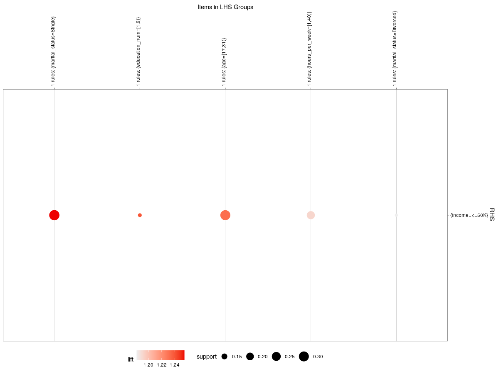
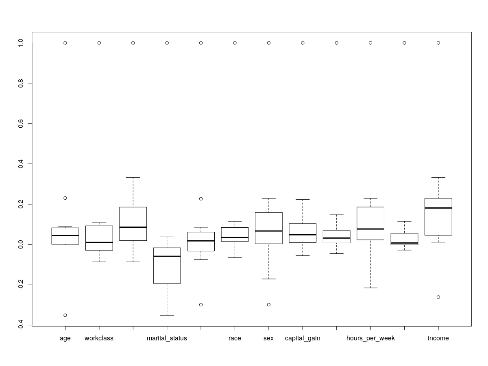
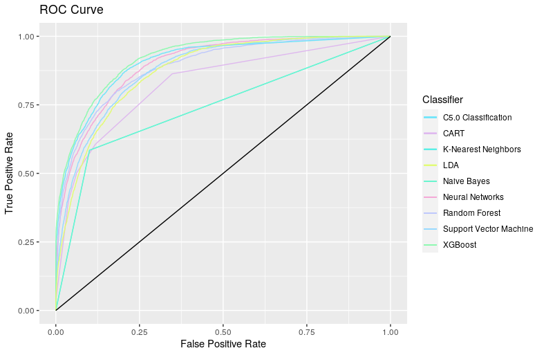

# Data analysis final assignment 2021-1

## 前言

成人数据集来自于 1994 年人口普查数据库，此数据集可在 [UCI Machine Learning Repository](https://archive.ics.uci.edu/ml/datasets/Adult) 中找到。本次作业的目标是，找出数据集中隐藏的模式和使用此数据集中的变量来预测个人的年收入是否超过 USD 50K。

------

## 数据集介绍

```text
age：每个样本的工作年龄，为数值型变量；
workclass：工作性质，这里有私人的、当地政府等，为字符型变量；
fnlwgt：是在一个州内，dataset的一个观测代表的人数；
education：每个样本的教育程度；
marital-status：每个样本的婚姻状况，包括未婚、已婚；
occupation：表示每个样本从事的职业；
relationship：每个样本的家庭成员；
race：样本的种族，有黑人和白人；
gender：样本的性别；
capital-gain：样本的资本收益；
capital-loss：样本的资本损失；
hours-per-week：样本每周工作时长；
native-country：表示样本来自哪个国家；
income：样本的收入，这里的收入有大于50K和小于等于50K
```

------

## 数据预处理

成人数据集是一个广泛使用的标准机器学习数据集，用于探索和演示许多一般性的或专门为不平衡分类设计的机器学习算法。

总共有 48842 行数据，3620 行含有缺失数据，45222 行具有完整的数据，其中缺失值用`?`标记。有 '>50K' 和 '<=50K' 两类标签数据，也就是说它是一个二分类任务。同时这些标签数据分布不平衡，'<=50K' 类标签相对比重更大。

具体的载入数据集方法使用 `read.csv` 。由于发现 `adult.data` 与 `adult.test` 中 `native_country` 的 `weight` 值不同，检查后发现两个数据都是完整的因此分别读取 `adult.data` 与 `adult.test` ，并合并后重新划分训练数据集与测试数据集。

```R
adult.temp.train <- read.csv(
  "data/adult/adult.data",
  sep = ",",
  fill = F,
  strip.white = T,
  col.names = c(
    "age", "workclass", "fnlwgt", "education",
    "education_num", "marital_status", "occupation", "relationship", "race", "sex",
    "capital_gain", "capital_loss", "hours_per_week", "native_country", "income"
  )
)
adult.temp.test <- read.csv(
  "data/adult/adult.test",
  sep = ",",
  fill = F,
  strip.white = T,
  col.names = c(
    "age", "workclass", "fnlwgt", "education",
    "education_num", "marital_status", "occupation", "relationship", "race", "sex",
    "capital_gain", "capital_loss", "hours_per_week", "native_country", "income"
  )
)

adult.data <- rbind(adult.temp.train, adult.temp.test)
```

为了简化分析，放弃加权因子，而目标的最高学历可以使用受教育的总年数来替代，而从性别和婚姻状态可以评估家庭关系，所以将会删除 `fnlwgt`, `education`, `relationship`

```R
adult.data$education <- NULL
adult.data$fnlwgt <- NULL
adult.data$relationship <- NULL
```

部分缺失的缺失值使用 `Unknown` 来替代 `?`，顺便删除变量 `i` （强迫症）

```R
adult.int.var <- colnames(adult.data)[which(sapply(adult.data, class) == 'integer')]
adult.fac.var <- colnames(adult.data)[which(sapply(adult.data, class) == 'factor')]
adult.data <- as.data.frame(lapply(adult.data, function(x) ifelse(x == "?", "Unknown", as.character(x))))
for(i in adult.int.var) {
  adult.data[i] <- as.numeric(unlist(adult.data[i]))
}
rm(i)
```

第一个变量 `age` 是一个通过判断可以发现是一个连续变量，因此先画一个按收入划分年龄直方图

```R
ggplot(adult.data) + aes(x=as.numeric(age), group=income, fill=income) + 
  geom_histogram(binwidth=1, color='black')
```

得到


注意到大多数人的收入都是在 `<=50K` ，而在 `>50K` 的人群中集中在职业生涯的中期

顺便再画一个按性别划分年龄直方图

```R
ggplot(adult) + aes(x=as.numeric(age), group=sex, fill=sex) + 
  geom_histogram(binwidth=1, color='black')
```

得到


有趣的是男性的代表数据与女性的不满足 `1:1`，这可能是由人口普查偏差造成的。

```R
summary(adult.data$workclass)
```

```R
#      Federal-gov        Local-gov     Never-worked          Private     Self-emp-inc 
#             1432             3136               10            33905             1695 
# Self-emp-not-inc        State-gov          Unknown      Without-pay 
#             3862             1980             2799               21 
```

`workclass` 变量代表的是阶级注意到有 `Never-worked` 和 `Without-pay` 两类，将他们与 `Unknown` 合并至 `Other/Unknown` ，而在政府工作的值过于细致，因此将其都合并至 `Government` ，最后将那些开公司的合并至 `Self-Employed`

```R
adult.data$workclass <- gsub("^Federal-gov", "Government", adult.data$workclass)
adult.data$workclass <- gsub("^Local-gov", "Government", adult.data$workclass)
adult.data$workclass <- gsub("^State-gov", "Government", adult.data$workclass)
adult.data$workclass <- gsub("^Self-emp-inc", "Self-Employed", adult.data$workclass)
adult.data$workclass <- gsub("^Self-emp-not-inc", "Self-Employed", adult.data$workclass)
adult.data$workclass <- gsub("^Never-worked", "Other", adult.data$workclass)
adult.data$workclass <- gsub("^Without-pay", "Other", adult.data$workclass)
adult.data$workclass <- gsub("^Other", "Other/Unknown", adult.data$workclass)
adult.data$workclass <- gsub("^Unknown", "Other/Unknown", adult.data$workclass)
adult.data$workclass <- as.factor(adult.data$workclass)
```

```R
summary(adult.data$workclass)
```

```R
#    Government Other/Unknown       Private Self-Employed 
#         6548          2830         33905          5557 
```

为了探索收入和阶级之间的关系，计算四种工作类别和两种收入的关系，并以条形图来表示

```R
adult.data.workclass.table <- table(adult.data[adult.data$workclass == 'Government',]$income)["<=50K"]
adult.data.workclass.table <- c(adult.data.workclass.table, table(adult.data[adult.data$workclass == 'Government',]$income)[">50K"])
adult.data.workclass.table <- c(adult.data.workclass.table, table(adult.data[adult.data$workclass == 'Other/Unknown',]$income)["<=50K"])
adult.data.workclass.table <- c(adult.data.workclass.table, table(adult.data[adult.data$workclass == 'Other/Unknown',]$income)[">50K"])
adult.data.workclass.table <- c(adult.data.workclass.table, table(adult.data[adult.data$workclass == 'Private',]$income)["<=50K"])
adult.data.workclass.table <- c(adult.data.workclass.table, table(adult.data[adult.data$workclass == 'Private',]$income)[">50K"])
adult.data.workclass.table <- c(adult.data.workclass.table, table(adult.data[adult.data$workclass == 'Self-Employed',]$income)["<=50K"])
adult.data.workclass.table <- c(adult.data.workclass.table, table(adult.data[adult.data$workclass == 'Self-Employed',]$income)[">50K"])
adult.data.workclass.table <- as.numeric(adult.data.workclass.table)
adult.data.workclass.industry <- rep(levels(adult.data$workclass), each = 2)
adult.data.workclass.income <- rep(c('<=50K', '>50K'), 4)
adult.data.workclass.df <- data.frame(adult.data.workclass.industry, adult.data.workclass.income, adult.data.workclass.table)
print(adult.data.workclass.df)
```

```R
#   adult.data.workclass.industry adult.data.workclass.income adult.data.workclass.table
# 1                    Government                       <=50K                       4530
# 2                    Government                        >50K                       2018
# 3                 Other/Unknown                       <=50K                       2563
# 4                 Other/Unknown                        >50K                        267
# 5                       Private                       <=50K                      26518
# 6                       Private                        >50K                       7387
# 7                 Self-Employed                       <=50K                       3542
# 8                 Self-Employed                        >50K                       2015
```

```R
adult.data.workclass.df <- ddply(adult.data.workclass.df, .(adult.data.workclass.industry), transform, percent = adult.data.workclass.table/sum(adult.data.workclass.table) * 100)
adult.data.workclass.df <- ddply(adult.data.workclass.df, .(adult.data.workclass.industry), transform, pos = (cumsum(adult.data.workclass.table) - 0.5 * adult.data.workclass.table))
adult.data.workclass.df$label <- paste0(sprintf("%.0f", adult.data.workclass.df$percent), "%")
ggplot(adult.data.workclass.df, aes(x = adult.data.workclass.industry, y = adult.data.workclass.table, fill = adult.data.workclass.income)) +
  geom_bar(stat = "identity") +
  geom_text(aes(y = pos, label = label), size = 3, position=position_stack(vjust = 0)) + 
  ggtitle('Income by Industry')
```


可以看出商人的收入 `>50K` 居多

同理对 `education_num` 进行处理

```R
adult.data.education.df <- data.frame(table(adult.data$income, adult.data$education_num))
names(adult.data.education.df) <- c('income', 'education_num', 'count')
adult.data.education.df <- ddply(adult.data.education.df, .(education_num), transform, percent = count/sum(count) * 100)
adult.data.education.df <- ddply(adult.data.education.df, .(education_num), transform, pos = (cumsum(count) - 0.5 * count))
adult.data.education.df$label <- paste0(sprintf("%.0f", adult.data.education.df$percent), "%")
print(adult.data.education.df)
ggplot(adult.data.education.df, aes(x = education_num, y = count, fill = income)) +
  geom_bar(stat = "identity") +
  geom_text(aes(y = pos, label = label), size = 2, position=position_stack(vjust = 0)) + 
  ggtitle('Income Level with Years of Education')

```

得到


我们不难发现，随着受教育年限的增加，年收入超过 50K USD 的群体比例也在增加。 对于没有任何形式的大学教育（少于或等于 8 年教育）的人，年收入超过 50K USD 的不到 10%。 而对于拥有博士学位的人来说，近四分之三的人年收入超过 50K USD。

接下来开始分析职业对收入的影响

```R
summary(adult.data$occupation)
```

```R
#      Adm-clerical      Armed-Forces      Craft-repair   Exec-managerial   Farming-fishing 
#              5610                15              6112              6086              1490 
# Handlers-cleaners Machine-op-inspct     Other-service   Priv-house-serv    Prof-specialty 
#              2072              3021              4923               242              6172 
#   Protective-serv             Sales      Tech-support  Transport-moving           Unknown 
#               983              5504              1446              2355              2809
```

为了简化模型，我们将职业分为蓝领、专业、销售、服务和白领。由于 `Armed-Forces` 人数较少，他们与未知数组合形成 `Other/Unknown`

```R
adult.data$occupation <- gsub("Adm-clerical", "White-Collar", adult.data$occupation)
adult.data$occupation <- gsub("Craft-repair", "Blue-Collar", adult.data$occupation)
adult.data$occupation <- gsub("Exec-managerial", "White-Collar", adult.data$occupation)
adult.data$occupation <- gsub("Farming-fishing", "Blue-Collar", adult.data$occupation)
adult.data$occupation <- gsub("Handlers-cleaners", "Blue-Collar", adult.data$occupation)
adult.data$occupation <- gsub("Machine-op-inspct", "Blue-Collar", adult.data$occupation)
adult.data$occupation <- gsub("Other-service", "Service", adult.data$occupation)
adult.data$occupation <- gsub("Priv-house-serv", "Service", adult.data$occupation)
adult.data$occupation <- gsub("Prof-specialty", "Professional", adult.data$occupation)
adult.data$occupation <- gsub("Protective-serv", "Service", adult.data$occupation)
adult.data$occupation <- gsub("Tech-support", "Service", adult.data$occupation)
adult.data$occupation <- gsub("Transport-moving", "Blue-Collar", adult.data$occupation)
adult.data$occupation <- gsub("Unknown", "Other/Unknown", adult.data$occupation)
adult.data$occupation <- gsub("Armed-Forces", "Other/Unknown", adult.data$occupation)
adult.data$occupation <- as.factor(adult.data$occupation)
summary(adult.data$occupation)
```

```R
#  Blue-Collar Other/Unknown  Professional         Sales       Service  White-Collar 
#        15050          2824          6172          5504          7594         11696
```

下面开始分析收入与职业的关系

```R
adult.data.occupation.df <- data.frame(table(adult.data$income, adult.data$occupation))
names(adult.data.occupation.df) <- c('income', 'occupation', 'count')
adult.data.occupation.df <- ddply(adult.data.occupation.df, .(occupation), transform, percent = count/sum(count) * 100)
adult.data.occupation.df <- ddply(adult.data.occupation.df, .(occupation), transform, pos = (cumsum(count) - 0.5 * count))
adult.data.occupation.df$label <- paste0(sprintf("%.0f", adult.data.occupation.df$percent), "%")
print(adult.data.occupation.df)
ggplot(adult.data.occupation.df, aes(x = occupation, y = count, fill = income)) +
  geom_bar(stat = "identity") +
  geom_text(aes(y = pos, label = label), size = 2, position=position_stack(vjust = 0)) + 
  ggtitle('Income Level with Different Occupations')
```

得到

```R
#    income    occupation count   percent     pos label
# 1   <=50K   Blue-Collar 12503 83.076412  6251.5   83%
# 2    >50K   Blue-Collar  2547 16.923588 13776.5   17%
# 3   <=50K Other/Unknown  2554 90.439093  1277.0   90%
# 4    >50K Other/Unknown   270  9.560907  2689.0   10%
# 5   <=50K  Professional  3388 54.893065  1694.0   55%
# 6    >50K  Professional  2784 45.106935  4780.0   45%
# 7   <=50K         Sales  4029 73.201308  2014.5   73%
# 8    >50K         Sales  1475 26.798692  4766.5   27%
# 9   <=50K       Service  6659 87.687648  3329.5   88%
# 10   >50K       Service   935 12.312352  7126.5   12%
# 11  <=50K  White-Collar  8020 68.570451  4010.0   69%
# 12   >50K  White-Collar  3676 31.429549  9858.0   31%
```


值得注意的是，不同职业的收入差异很大。 近一半的专业职业的年收入超过 50K USD，而服务职业的这一比例仅为 12%。

`marital_status` 是一个分类变量有 7 个类别，以婚姻状况，它也可以分为几类。

```R
summary(adult.data$marital_status)
```

```R
#             Divorced     Married-AF-spouse    Married-civ-spouse Married-spouse-absent 
#                 6633                    37                 22379                   628 
#        Never-married             Separated               Widowed 
#                16115                  1530                  1518 
```

```R
adult.data$marital_status <- gsub("Married-AF-spouse", "Married", adult.data$marital_status)
adult.data$marital_status <- gsub("Married-civ-spouse", "Married", adult.data$marital_status)
adult.data$marital_status <- gsub("Married-spouse-absent", "Married", adult.data$marital_status)
adult.data$marital_status <- gsub("Never-married", "Single", adult.data$marital_status)
adult.data$marital_status <- as.factor(adult.data$marital_status)
summary(adult.data$marital_status)
```

```R
#  Divorced   Married Separated    Single   Widowed 
#      6633     23044      1530     16115      1518
```

开始分析家庭状况与职业的关系

```R
adult.data.marital.df <- data.frame(table(adult.data$income, adult.data$marital_status))
names(adult.data.marital.df) <- c('income', 'marital_status', 'count')
adult.data.marital.df <- ddply(adult.data.marital.df, .(marital_status), transform, percent = count/sum(count) * 100)
adult.data.marital.df <- ddply(adult.data.marital.df, .(marital_status), transform, pos = (cumsum(count) - 0.5 * count))
adult.data.marital.df$label <- paste0(sprintf("%.0f", adult.data.marital.df$percent), "%")
print(adult.data.marital.df)
ggplot(adult.data.marital.df, aes(x = marital_status, y = count, fill = income)) +
  geom_bar(stat = "identity") +
  geom_text(aes(y = pos, label = label), size = 2, position=position_stack(vjust = 0)) + 
  ggtitle('Income Level with Marital Status')
```

```R
#    income marital_status count   percent     pos label
# 1   <=50K       Divorced  5962 89.883914  2981.0   90%
# 2    >50K       Divorced   671 10.116086  6297.5   10%
# 3   <=50K        Married 12988 56.361743  6494.0   56%
# 4    >50K        Married 10056 43.638257 18016.0   44%
# 5   <=50K      Separated  1431 93.529412   715.5   94%
# 6    >50K      Separated    99  6.470588  1480.5    6%
# 7   <=50K         Single 15382 95.451443  7691.0   95%
# 8    >50K         Single   733  4.548557 15748.5    5%
# 9   <=50K        Widowed  1390 91.567852   695.0   92%
# 10   >50K        Widowed   128  8.432148  1454.0    8%
```


不管是否结婚，大多的人收入都在 50K USD 之下

下面看看人种


可以发此次的调查中主要以白种人为主

最后预览一下整体的数据

```R
summary(adult.data)
```

```R
#      age                workclass     education_num      marital_status          occupation   
# Min.   : 1.00   Government   : 6548   Min.   : 1.000   Divorced : 6633   Blue-Collar  :15050  
# 1st Qu.:12.00   Other/Unknown: 2830   1st Qu.: 3.000   Married  :23044   Other/Unknown: 2824  
# Median :21.00   Private      :33905   Median : 6.000   Separated: 1530   Professional : 6172  
# Mean   :22.64   Self-Employed: 5557   Mean   : 8.882   Single   :16115   Sales        : 5504  
# 3rd Qu.:32.00                         3rd Qu.:16.000   Widowed  : 1518   Service      : 7594  
# Max.   :74.00                         Max.   :16.000                     White-Collar :11696  
#                                                                                               
#                 race           sex         capital_gain      capital_loss    hours_per_week 
# Amer-Indian-Eskimo:  470   Female:16192   Min.   :  1.000   Min.   : 1.000   Min.   : 1.00  
# Asian-Pac-Islander: 1519   Male  :32648   1st Qu.:  1.000   1st Qu.: 1.000   1st Qu.:35.00  
# Black             : 4684                  Median :  1.000   Median : 1.000   Median :35.00  
# Other             :  406                  Mean   :  6.951   Mean   : 2.948   Mean   :36.08  
# White             :41761                  3rd Qu.:  1.000   3rd Qu.: 1.000   3rd Qu.:40.00  
#                                           Max.   :123.000   Max.   :99.000   Max.   :96.00  
#                                                                                             
#       native_country    income     
# United-States:43830   <=50K:37153  
# Mexico       :  951   >50K :11687  
# Unknown      :  857                
# Philippines  :  295                
# Germany      :  206                
# Puerto-Rico  :  184                
# (Other)      : 2517 
```

最后是切割数据集，将训练数据与测试数据按照 3:7 的比例进行分割

```R
set.seed(23333)
adult.index <- sample(nrow(adult.data), nrow(adult.data) * 0.7)
adult.train <- adult.data[adult.index, ]
adult.test <- adult.data[-adult.index, ]
```

得到训练数据为 34,188 条，测试数据为 14,652 条

------

## 寻找数据中隐藏的模式

### Association Rules（关联规则）

关联规则是反映一个事物与其他事物之间的相互依存性和关联性，是数据挖掘的一个重要技术，用于从大量数据中挖掘出有价值的数据项之间的相关关系。
使用关联规则算法可以探究本数据中人口数据中各项指标的关联性，以及收入高低和其他因素的影响。

为了探究各因素之间互相的关联，采用Apriori算法，结合数据实际，取最小支持度为0.12，最小置信度为0.2333，最小规则数为2，最大规则数为2。得到规则总共290条规则。

对提升度进行排序，展示其中最高的10条规则。

如下所示，我们可以得到几条关联规则。
单身的人更可能处于17至31岁。有婚配关系的个体更可能有收入较高。
女性的每周工作时间更容易偏低。教育经历在9、10年的人群更可能成为蓝领。
教育经历在10到16年之间人更有可能获取高收入。

```R
#aporiori for maxlen = 2
adult.apriori.2 <- apriori(data = adult.data, parameter = list(support = 0.12, confidence = 0.2333, minlen = 2, maxlen = 2))
summary(adult.apriori.2)

#show lift TOP10
inspect(sort(adult.apriori,by="lift")[1:10])
```

```R
#      lhs                         rhs                      support   confidence coverage  lift     count
# [1]  {marital_status=Single}  => {age=[17,31)}            0.2310606 0.7002792  0.3299550 2.165757 11285
# [2]  {age=[17,31)}            => {marital_status=Single}  0.2310606 0.7146023  0.3233415 2.165757 11285
# [3]  {income=>50K}            => {marital_status=Married} 0.2058968 0.8604432  0.2392916 1.823644 10056
# [4]  {marital_status=Married} => {income=>50K}            0.2058968 0.4363826  0.4718264 1.823644 10056
# [5]  {hours_per_week=[1,40)}  => {sex=Female}             0.1267199 0.5295628  0.2392916 1.597322  6189
# [6]  {sex=Female}             => {hours_per_week=[1,40)}  0.1267199 0.3822258  0.3315315 1.597322  6189
# [7]  {occupation=Blue-Collar} => {education_num=[9,10)}   0.1470311 0.4771429  0.3081491 1.476410  7181
# [8]  {education_num=[9,10)}   => {occupation=Blue-Collar} 0.1470311 0.4549544  0.3231777 1.476410  7181
# [9]  {income=>50K}            => {education_num=[10,16]}  0.1805487 0.7545136  0.2392916 1.382808  8818
# [10] {education_num=[10,16]}  => {income=>50K}            0.1805487 0.3308942  0.5456388 1.382808  8818
```

在数据集寻找有关收入高低的关联规则。
首先寻找有关高收入的关联规则。

```R
#about high income
adult.apriori.highIncome <- subset(adult.apriori.2, rhs %in% c("income=>50K"))
inspect(sort(adult.apriori.highIncome,by="lift")[1:5])
plot(sort(adult.apriori.highIncome,by="lift")[1:5], method = "group")
```



如图所示，具备以下因素的人很可能有高收入。婚姻状态为已婚，教育经历高于10年，性别为男性，每周工作时间较长，人种为白人。

再寻找低收入关联的因素进行分析。

```R
adult.apriori.lowIncome <- subset(adult.apriori.2, rhs %in% c("income=<=50K"))
inspect(sort(adult.apriori.lowIncome,by="lift")[1:5])
plot(sort(adult.apriori.lowIncome,by="lift")[1:5], method = "group")
```



可以分析得到，具备以下因素的人很有可能收入较低。婚姻关系为单身或离异，教育经历少于9年，每周较短的工作时间，年龄低于31岁。

对数据集进行修改，去除收入变量。将最大规则数改为3。展示提升度最高的5条规则。

如下所示，我们可以得知。高学历群体在31岁前有很高的可能未婚。单身白种人很可能属于年青群体。工作为个体的单身年轻人很可能未婚祖国为美国的17到31的人很可能是单身。单身男性很可能是17到31岁。

```R
#aporiori for maxlen = 3
adult.apriori.3 <- apriori(data = adult.data, parameter = list(support = 0.12, confidence = 0.2333, minlen = 2, maxlen =3))
summary(adult.apriori)

#show lift TOP3
inspect(sort(adult.apriori.3,by="lift")[1:3])
```

```R
#     lhs                                           rhs                     support   confidence coverage  lift     count
# [1] {age=[17,31),education_num=[10,16]}        => {marital_status=Single} 0.1277437 0.7413260  0.1723178 2.246749  6239
# [2] {workclass=Private,marital_status=Single}  => {age=[17,31)}           0.1804464 0.7198987  0.2506552 2.226434  8813
# [3] {marital_status=Single,race=White}         => {age=[17,31)}           0.1932228 0.7140047  0.2706183 2.208206  9437
# [4] {age=[17,31),native_country=United-States} => {marital_status=Single} 0.2075348 0.7173390  0.2893120 2.174051 10136
# [5] {marital_status=Single,sex=Male}           => {age=[17,31)}           0.1276208 0.7005732  0.1821663 2.166666  6233
```

### k-means（k均值聚类算法）

k均值聚类算法（k-means clustering algorithm）是一种迭代求解的聚类分析算法，其步骤是，预将数据分为K组，则随机选取K个对象作为初始的聚类中心，然后计算每个对象与各个种子聚类中心之间的距离，把每个对象分配给距离它最近的聚类中心。聚类中心以及分配给它们的对象就代表一个聚类。每分配一个样本，聚类的聚类中心会根据聚类中现有的对象被重新计算。这个过程将不断重复直到满足某个终止条件。终止条件可以是没有（或最小数目）对象被重新分配给不同的聚类，没有（或最小数目）聚类中心再发生变化，误差平方和局部最小。

数据预处理后的数据仍有部分数据为因子类型，而kmean只能计算欧几里得距离，需要对所有数据进行数值化。

依照上文分析所得的结论，按照每个因素对收入的影响进行数值化。以负面影响的因素数值小，正面影响的因素数值大的原则进行处理，并去除native_country变量。

```R
adult.kmeans.data <- adult.data
adult.kmeans.data$native_country <- NULL
G <- matrix(0,48840,1)
  #workclass
G[which(adult.kmeans.data$workclass=="Other/Unknown")] <- 0
G[which(adult.kmeans.data$workclass=="Self-Employed")] <- 10
G[which(adult.kmeans.data$workclass=="Government")] <- 20
G[which(adult.kmeans.data$workclass=="Private")] <- 30
adult.kmeans.data$workclass <- NULL
adult.kmeans.data$workclass <- G
  #marital_status
G[which(adult.kmeans.data$marital_status=="Separated")] <- 0
G[which(adult.kmeans.data$marital_status=="Widowed")] <- 10
G[which(adult.kmeans.data$marital_status=="Single")] <- 20
G[which(adult.kmeans.data$marital_status=="Divorced")] <- 30
G[which(adult.kmeans.data$marital_status=="Married")] <- 40
adult.kmeans.data$marital_status <- NULL
adult.kmeans.data$marital_status <- G
  #occupation
G[which(adult.kmeans.data$occupation=="Other/Unknown")] <- 0
G[which(adult.kmeans.data$occupation=="Service")] <- 10
G[which(adult.kmeans.data$occupation=="Blue-Collar")] <- 20
G[which(adult.kmeans.data$occupation=="Sales")] <- 30
G[which(adult.kmeans.data$occupation=="White-Collar")] <- 40
G[which(adult.kmeans.data$occupation=="Professional")] <- 50
adult.kmeans.data$occupation <- NULL
adult.kmeans.data$occupation <- G
  #race
G[which(adult.kmeans.data$race=="Other")] <- 0
G[which(adult.kmeans.data$race=="Black")] <- 10
G[which(adult.kmeans.data$race=="White")] <- 20
G[which(adult.kmeans.data$race=="Black")] <- 30
G[which(adult.kmeans.data$race=="Asian-Pac-Islander")] <- 40
adult.kmeans.data$race <- NULL
adult.kmeans.data$race <- G
  #sex
G[which(adult.kmeans.data$sex=="Female")] <- 0
G[which(adult.kmeans.data$sex=="Male")] <- 10
adult.kmeans.data$sex <- NULL
adult.kmeans.data$sex <- G
  #income
G[which(adult.kmeans.data$income=="<=50K")] <- 0
G[which(adult.kmeans.data$income==">50K")] <- 10
adult.kmeans.data$income <- NULL
adult.kmeans.data$income <- G
```

找出k-means最优的聚类数,画出折线图。

```R
#best number of group
 #plot
adult.kmeans.wss <- (nrow(adult.kmeans.data) - 1) * sum(apply(adult.kmeans.data, 2, var))
for (i in 2:15) 
  adult.kmeans.wss[i] <- sum(kmeans(adult.kmeans.data, centers = i)$withinss)
plot(1:15, adult.kmeans.wss, type = "b", xlab = "Number of Clusters", ylab = "Within groups sum of squares")
```


按照聚类数为4，进行k-means聚类，画出分类图以及雷达图。

```R
#kmeans
adult.kmeans <- kmeans(adult.kmeans.data, 4, nstart = 24)
print(adult.kmeans)

#kmeans-plot
autoplot(adult.kmeans, data = adult.kmeans.data, label = TRUE,label.size = 3)

#Radar Chart
adult.kmeans.max <- apply(adult.kmeans$centers, 2, max)
adult.kmeans.min <- apply(adult.kmeans$centers, 2, min)
adult.kmeans.df <- data.frame(rbind(adult.kmeans.max, adult.kmeans.min, adult.kmeans$centers))
radarchart(df = adult.kmeans.df, seg = 3, plty = 1:4, vlcex = 1, plwd = 3)
L <- 1
for (i in 1:4) {
  legend(1.4,L,legend=paste("group",i),lty = i,lwd = 4,col=i,bty = "n")
  L <- L-0.2
}
```


由上图我们可以把人口分为四类人群:

group1的特征为，资本增值高，收入最高，人群年龄最高，工作时间最长，主要以男性为主。

group2的特征为，年龄偏大，受教育水平高，收入高，行业以政府部门为主，工作市场不高，主要以男性为主。

group3的特征为，没有受到多少资本增值或损失的影响，各方面因素都很平衡，性别年龄分布比较均匀，同时收入也很中庸。

group4的特征为，资本损失极大、行业以个体为主人群，收入及各项因素均偏低。且仅有这个群体婚姻状况不好。

### EFA（探索性因子分析）

探索性因子分析是一系列用来发现一组变量的潜在结构的方法。它通过寻找一组更小的、潜在的或隐藏的结构来解释已观测到的、显式的变量间的关系。

探索性因子分析有助于建立新的假设。

首先计算相关系数矩阵画出箱型图

```R
#data
adult.efa.data <- as.data.frame(sapply(adult.data, as.numeric))
adult.efa.data <- cor(adult.efa.data)
boxplot(adult.efa.data)
```



判断需提取的公共因子数，生成含平行分析的碎石图。

```R
#best number of factor
fa.parallel(adult.efa.data , n.obs = 240, fa = "both", n.iter = 100, main = "平行分析碎石图")
```


在尝试了最大相似法、主轴迭代法等方式后，选择使用加权最小二乘法提取公因子，并且不旋转因子。

```R
adult.efa.fa <- fa(correlations, nfactors = 3, rotate = "none", fm = "wls")
adult.efa.fa
fa.diagram(adult.efa.fa,simple = TRUE, digits = 3)
```


WLS2和WLS3并没有表现出与众多变量的相关性，故抛去。

WLS1因子上age、marital_status、hours_per_week、sex、education_num、income载荷较大。初步认为可以将该因子命名为工作好坏因子。但因该因子对数据集的解释程度较低，无法用作降维，仅能用作对数据集隐式模式的探索。

由上述分析可以得出，通过研究年龄、婚姻状态、每周工作时长、性别、教育水平、收入，可以衡量一个工作的好坏。

------

## 模型训练和数据预测

### ANN

  首先先使用 ANN 来预测的年收入是否超过 50K USD， 模型在训练集上训练并在测试集上验证。首先，训练具有一个隐藏层的人工神经网络 (ANN)。 尽管只有 11 个输入变量，但其中许多是分类变量，会产生较多虚变量。 因此，隐藏节点的数量选择为 40，最小二乘法用于优化目标函数，最大迭代次数设置为 5,000。

```R
library(nnet)
library(NeuralNetTools)
adult.nn <- nnet(income ~ ., data = adult.train, size = 40, maxit = 500, MaxNWts = 2601)
plotnet(adult.nn)
```

```R
# # weights:  2601
# initial  value 52120.185242 
# iter  10 value 15552.059189
# iter  20 value 14421.361912
# iter  30 value 13271.253019
# iter  40 value 12496.316135
# iter  50 value 12172.354951
# iter  60 value 11901.846632
# iter  70 value 11779.494264
# iter  80 value 11627.917054
# iter  90 value 11441.503651
# iter 100 value 11281.892003
# iter 110 value 11192.189916
# iter 120 value 11087.418463
# iter 130 value 10939.808253
# iter 140 value 10859.531186
# iter 150 value 10754.086877
# iter 160 value 10675.936043
# iter 170 value 10600.975360
# iter 180 value 10505.529872
# iter 190 value 10423.231567
# iter 200 value 10340.202806
# iter 210 value 10300.016357
# iter 220 value 10238.036887
# iter 230 value 10187.300882
# iter 240 value 10131.828147
# iter 250 value 10085.325149
# iter 260 value 10047.710247
# iter 270 value 10045.277823
# iter 280 value 10042.812999
# iter 290 value 10039.824645
# iter 300 value 10037.224278
# iter 310 value 10035.019297
# iter 320 value 10032.227456
# iter 330 value 10029.413206
# iter 340 value 10021.152807
# iter 350 value 10013.435598
# iter 360 value 10005.295497
# iter 370 value 9993.348291
# iter 380 value 9985.572948
# iter 390 value 9977.779599
# iter 400 value 9969.156118
# iter 410 value 9956.745958
# iter 420 value 9944.981710
# iter 430 value 9929.263521
# iter 440 value 9910.805861
# iter 450 value 9891.476112
# iter 460 value 9871.896602
# iter 470 value 9845.841540
# iter 480 value 9813.545272
# iter 490 value 9785.832663
# iter 500 value 9767.999631
# final  value 9767.999631 
# stopped after 500 iterations
```


```R
adult.nn.pred <- predict(adult.nn, select(adult.test, -income), type = 'raw')
adult.nn.pred.tr <- rep('<=50K', length(adult.nn.pred))
adult.nn.pred.tr[adult.nn.pred.tr >= .5] <- '>50K'
adult.nn.pred.table <- table(adult.nn.pred.tr, adult.test$income)
print(adult.nn.pred.table)
sum(diag(adult.nn.pred.table))/sum(adult.nn.pred.table)
```

```R
# adult.nn.pred.tr <=50K  >50K
#             >50K 11150  3502
```

ANN 的预测结果准确率为 `76.10%`，错误率为 `23.90%`。

### CART（决策树）

CART 算法是一个二叉树算法，在生长过程采用的是最大基尼增益指数

```R
library(rpart)
library(rpart.plot)

adult.rpart <- rpart(income ~ ., data = adult.train, method = 'class')
rpart.plot(adult.rpart)
```


上图是决策树剪枝前的图示，根部的这个节点上的 100%表示数据都还没有进行过分类。在观测数据内，婚姻状态为 `Divorced, Separated, Single, Widowed` 同时收入小于 50K USD 的占总数的 53%

```R
adult.rpart.pred.prob <- predict(adult.rpart, select(adult.test, -income), type = 'prob')
adult.rpart.pred <- predict(adult.rpart, select(adult.test, -income), type = 'class')
adult.rpart.pred.table <- table(adult.rpart.pred, adult.test$income)
sum(diag(adult.rpart.pred.table))/sum(adult.rpart.pred.table)
```

```R
# adult.rpart.pred <=50K  >50K
#           <=50K 10448  1739
#           >50K    702  1763
```

CART 算法的预测结果准确率为 `83.34%`，错误率为 `16.66%`。

### C5.0（决策树）

C5.0算法是一种多叉树算法，生长过程采用的是最大信息增益率原则进行节点选择和分裂点的选择

```R
library(C50)

adult.c50 <- C5.0(income ~ ., data = adult.train,  trials = 10)
adult.c50.pred.prob <- predict(adult.c50, select(adult.test, -income), type = 'prob')
adult.c50.pred <- predict(adult.c50, select(adult.test, -income), type = 'class')
adult.c50.pred.table <- table(adult.c50.pred, adult.test$income)
sum(diag(adult.c50.pred.table))/sum(adult.c50.pred.table)
```

```R
# adult.c50.pred <=50K  >50K
#         <=50K 10528  1385
#         >50K    622  2117
```

C5.0 算法的预测结果准确率为 `86.30%`，错误率为 `13.70%`。

### Random Forest（随机森林）

随机森林 (RF) 是一个强大的机器学习工具，它通过生成大量自举树来提高预测准确性，最终预测结果是通过组合所有树的结果来获得的。

确定最优决策树节点分支所选择的变量个数，确定决策树的数量。

```R
#best number of mtry
n <- length(names(adult.train))
rate <- 1
for(i in 1:10){
  set.seed(2333)
  adult.rf.test <- randomForest(income ~ ., data = adult.train, mtry = i, ntree=500)
  rate[i]<-mean(adult.rf.test$err.rate)
}
rate

#best number of ntree
set.seed(2333)
adult.rf.test<-randomForest(income~., data=adult.train, mtry=3, ntree=1000)
plot(adult.rf.test)
legend(800,0.02, "IS_LIUSHI=0", cex=0.9, bty="n")    
legend(800,0.0245, "total", cex=0.09, bty="n")
```

使用mtry=3, ntree=500为参数训练随机森林模型

```R
library(randomForest)

adult.rf <- randomForest(income ~ ., data = adult.train, mtry=3, ntree=500)
varImpPlot(adult.rf)
adult.rf.pred.prob <- predict(adult.rf, select(adult.test, -income), type = 'prob')
adult.rf.pred <- predict(adult.rf, select(adult.test, -income), type = 'class')
adult.rf.pred.table <- table(adult.rf.pred, adult.test$income)
sum(diag(adult.rf.pred.table))/sum(adult.rf.pred.table)
```


上图显示的是平均减少的准确率，其中每个点即代表移除相应的特征后平均减少的准确率，故越高的变量越重要。不难看出，marital_status(婚姻状况)、age(年龄)、education_num(受教育年限)较为重要。

```R
# adult.rf.pred <=50K  >50K
#        <=50K 10421  1376
#        >50K    729  2126
```

随机森林的预测结果准确率为 `85.63%`，错误率为 `14.37%`。

### SVM（支持向量机）

然后使用支持向量机（SVM）来预测收入水平。 SVM 是一种判别分类器，它在用于分类的高维空间中构造超平面。

AUC 被定义为 ROC 曲线下与坐标轴围成的面积。AUC 越接近 1.0，检测方法的真实性越高；等于0.5时，则真实度越低，无应用价值。

```R
library(e1071)

adult.svm.linear <- svm(income ~ ., data = adult.train, decision.values = TRUE, kernel = 'linear')
adult.svm.linear.pred.prob <- attributes(predict(adult.svm.linear, select(adult.test, -income), decision.values = TRUE))$decision.values
adult.svm.linear.pr <- prediction(adult.svm.linear.pred.prob, adult.test$income)
adult.svm.linear.prf <- performance(adult.svm.linear.pr, measure = "tpr", x.measure = "fpr")
adult.svm.linear.dd <- data.frame(FP = adult.svm.linear.prf@x.values[[1]], TP = adult.svm.linear.prf@y.values[[1]])

adult.svm.polynomial <- svm(income ~ ., data = adult.train, decision.values = TRUE, kernel = 'polynomial')
adult.svm.polynomial.pred.prob <- attributes(predict(adult.svm.polynomial, select(adult.test, -income), decision.values = TRUE))$decision.values
adult.svm.polynomial.pr <- prediction(adult.svm.polynomial.pred.prob, adult.test$income)
adult.svm.polynomial.prf <- performance(adult.svm.polynomial.pr, measure = "tpr", x.measure = "fpr")
adult.svm.polynomial.dd <- data.frame(FP = adult.svm.polynomial.prf@x.values[[1]], TP = adult.svm.polynomial.prf@y.values[[1]])

adult.svm.radial <- svm(income ~ ., data = adult.train, decision.values = TRUE, kernel = 'radial')
adult.svm.radial.pred.prob <- attributes(predict(adult.svm.radial, select(adult.test, -income), decision.values = TRUE))$decision.values
adult.svm.radial.pr <- prediction(adult.svm.radial.pred.prob, adult.test$income)
adult.svm.radial.prf <- performance(adult.svm.radial.pr, measure = "tpr", x.measure = "fpr")
adult.svm.radial.dd <- data.frame(FP = adult.svm.radial.prf@x.values[[1]], TP = adult.svm.radial.prf@y.values[[1]])


adult.svm.sigmoid <- svm(income ~ ., data = adult.train, decision.values = TRUE, kernel = 'sigmoid')
adult.svm.sigmoid.pred.prob <- attributes(predict(adult.svm.sigmoid, select(adult.test, -income), decision.values = TRUE))$decision.values
adult.svm.sigmoid.pr <- prediction(adult.svm.sigmoid.pred.prob, adult.test$income)
adult.svm.sigmoid.prf <- performance(adult.svm.sigmoid.pr, measure = "tpr", x.measure = "fpr")
adult.svm.sigmoid.dd <- data.frame(FP = adult.svm.sigmoid.prf@x.values[[1]], TP = adult.svm.sigmoid.prf@y.values[[1]])

adult.roc <- ggplot() + 
  geom_line(data = adult.svm.linear.dd, aes(x = FP, y = TP, color = 'SVM - Linear')) + 
  geom_line(data = adult.svm.polynomial.dd, aes(x = FP, y = TP, color = 'SVM - Polynomial')) + 
  geom_line(data = adult.svm.radial.dd, aes(x = FP, y = TP, color = 'SVM - Radial')) +
  geom_line(data = adult.svm.sigmoid.dd, aes(x = FP, y = TP, color = 'SVM - Sigmoid')) +
  geom_segment(aes(x = 0, xend = 1, y = 0, yend = 1)) +
  ggtitle('ROC Curve') + 
  labs(x = 'False Positive Rate', y = 'True Positive Rate') 

adult.roc + scale_colour_manual(name = 'Classifier', values = c(
  'SVM - Linear' = '#F4A8D7', 
  'SVM - Polynomial' = '#DEB8EE',
  'SVM - Radial' = '#BEC8FC', 
  'SVM - Sigmoid' = '#98D9FF'
))

adult.auc <- rbind(performance(adult.svm.linear.pr, measure = 'auc')@y.values[[1]],
                   performance(adult.svm.polynomial.pr, measure = 'auc')@y.values[[1]],
                   performance(adult.svm.radial.pr, measure = 'auc')@y.values[[1]],
                   performance(adult.svm.sigmoid.pr, measure = 'auc')@y.values[[1]])
rownames(adult.auc) <- (c('SVM - Linear', 'SVM - Polynomial', 'SVM - Radial', 'SVM - Sigmoid'))
colnames(adult.auc) <- 'Area Under ROC Curve'
round(adult.auc, 4)
```

我们通过切换不同的内核，并画出 ROC 曲线同时计算 AUC。


```R
#                  Area Under ROC Curve
# SVM - Linear                   0.8665
# SVM - Polynomial               0.8626
# SVM - Radial                   0.8816
# SVM - Sigmoid                  0.8397
```

根据结果可以得出在使用 `radial` 时所得到的准确度是是最高，因此使用 `radial` 进行预测

```R
adult.svm.radial.pred <- predict(adult.svm.radial, select(adult.test, -income))
adult.svm.radial.pred.table <- table(adult.svm.radial.pred, adult.test$income)
sum(diag(adult.svm.radial.pred.table))/sum(adult.svm.radial.pred.table)
```

```R
# adult.svm.pred <=50K  >50K
#          <=50K 10300  1520
#          >50K    850  1982
```

支持向量机的预测结果准确率为 `83.82%`，错误率为 `16.18%`。

### KNN （K-近邻算法）

通过这个数据的 K 个最近的邻居来判断该数据类别

```R
library(kknn)

adult.knn <- kknn(income ~ ., train = adult.train, test = adult.test, k = 7, distance = 2)
adult.knn.pred <- fitted(adult.knn)
adult.knn.pred.table <- table(adult.knn.pred, adult.test$income)
sum(diag(adult.knn.pred.table))/sum(adult.knn.pred.table)
```

```R
# adult.svm.pred <=50K  >50K
#          <=50K 10300  1520
#          >50K    850  1982
```

```R
adult.knn.numeric <- NULL
for (i in 1:50) {
  adult.knn.numeric.for <- kknn(income ~ ., train = adult.train, test = adult.test, k = i, distance = 2)
  adult.knn.numeric.for.pred <- fitted(adult.knn.numeric.for)
  adult.knn.numeric.for.pred.table <- table(adult.knn.numeric.for.pred, adult.test$income)
  adult.knn.numeric[i] <- sum(diag(adult.knn.numeric.for.pred.table)) / sum(adult.knn.numeric.for.pred.table)
}
rm(adult.knn.numeric.for, i)
ggplot(data.frame(1:50, adult.knn.numeric[1:50]), aes(x = 1:50, y = adult.knn.numeric[1:50])) + geom_line(size = 0.8)
```


从上图可以看出当 `K = 50` 时，所预测的结果为最佳，因此

```R
adult.knn <- kknn(income ~ ., train = adult.train, test = adult.test, k = 50, distance = 2)
adult.knn.pred <- fitted(adult.knn)
adult.knn.pred.table <- table(adult.knn.pred, adult.test$income)
sum(diag(adult.knn.pred.table))/sum(adult.knn.pred.table)
```

```R
# adult.knn.pred <=50K  >50K
#          <=50K 10288  1469
#          >50K    862  2033
```

K-近邻算法的预测结果准确率为 `84.09%`，错误率为 `15.91%`。

### LDA

线性判别分析是对费舍尔的线性鉴别方法的归纳，这种方法使用统计学，模式识别和机器学习方法，试图找到两类物体或事件的特征的一个线性组合，以能够特征化或区分它们。所得的组合可用来作为一个线性分类器，或者，更常见的是，为后续的分类做降维处理。

```R
library(MASS)

adult.lda <- lda(income ~ ., data = adult.data)
summary(adult.lda)
adult.lda.pred <- predict(adult.lda,adult.test)
adult.lda.pred.table <- table(adult.test$income, adult.lda.pred$class)
sum(diag(adult.lda.pred.table))/sum(adult.lda.pred.table)
```

```R
# adult.nb.pred <=50K  >50K
#         <=50K 10206   944
#         >50K   1565  1937
```

线性判别分析的预测结果准确率为82.9%，错误率为17.1%。

### Naive Bayes（朴素贝叶斯）

朴素贝叶斯法是基于贝叶斯定理与特征条件独立假设的分类方法。对于给定的训练集数据，首先基于特征条件独立假设学习输入输出的联合概率分布；然后基于此模型，对给定的输入 x，利用贝叶斯定理求出后验概率最大的输出 y，朴素贝叶斯法实现简单，学习和预测效率都很高，是一种常用的方法。

而其公式为
$$
y=f(x)=\mathop{\arg\max}_{c_k}\prod{P(X^{(j)}=x^{(j)}|Y=c_k)}
$$

```R
library(e1071)

adult.nb <- naiveBayes(x = adult.train[, 1:11], y = adult.train$income, decision.values = TRUE)
adult.nb.pred <- predict(adult.nb, select(adult.test, -income))
adult.nb.pred.table <- table(adult.nb.pred, adult.test$income)
sum(diag(adult.nb.pred.table))/sum(adult.nb.pred.table)
```

```R
# adult.nb.pred <=50K  >50K
#         <=50K 10366  2065
#         >50K    784  1437
```

朴素贝叶斯的预测结果准确率为 `80.56%`，错误率为 `19.44%`。

### XGBoost

XGboost 全名为 eXtreme Gradient Boosting (极限梯度提升)，XGBoost 主要是用来解决有监督学习问题

```R
library(Matrix)
library(xgboost)
library(DiagrammeR)

adult.xgb.matrix.train <- sparse.model.matrix(income ~ ., data = adult.train)
adult.xgb.matrix.train.Y <- as.numeric(adult.train$income) - 1
adult.xgb.matrix.test <- sparse.model.matrix(income ~ ., data = adult.test)
adult.xgb <- xgboost(
  data = adult.xgb.matrix.train,
  label = adult.xgb.matrix.train.Y,
  max.depth = 4,
  eta = 0.5,
  lambda = 0.7,
  min_child_weight = 10,
  eval_metric = 'auc',
  nthread = 3,
  nround = 100,
  objective = "binary:logistic"
)
xgb.plot.tree(model = adult.xgb, trees = 1)
```


```R
adult.xgb.pred.prob <- predict(adult.xgb, adult.xgb.matrix.test, type = 'prob')
adult.xgb.pred <- predict(adult.xgb, adult.xgb.matrix.test)
adult.xgb.pred.table <- table(ifelse(adult.xgb.pred > 0.5, 1, 0), as.numeric(na.omit(adult.test)$income))
sum(diag(adult.xgb.pred.table))/sum(adult.xgb.pred.table)
```

```R
#        1     2
#  0 10468  1287
#  1   682  2215
```

XGBoost 的预测结果准确率为 `86.56%`，错误率为 `13.44%`。

## 结论

ROC 曲线是在所有阈值下真阳性率与假阳性率的关系图。使用 ROC 曲线比较九个不同的分类器。

```R
library(plyr)
library(ROCR)

# ANN
adult.nn.pr <- prediction(adult.nn.pred, adult.test$income)
adult.nn.prf <- performance(adult.nn.pr, measure = "tpr", x.measure = "fpr")
adult.nn.dd <- data.frame(FP = adult.nn.prf@x.values[[1]], TP = adult.nn.prf@y.values[[1]])

# CART
adult.cart.pr <- prediction(adult.cart.pred.prob[, 2], adult.test$income)
adult.cart.prf <- performance(adult.cart.pr, measure = "tpr", x.measure = "fpr")
adult.cart.dd <- data.frame(FP = adult.cart.prf@x.values[[1]], TP = adult.cart.prf@y.values[[1]])

# Random Forest
adult.rf.pr <- prediction(adult.rf.pred.prob[, 2], adult.test$income)
adult.rf.prf <- performance(adult.rf.pr, measure = "tpr", x.measure = "fpr")
adult.rf.dd <- data.frame(FP = adult.rf.prf@x.values[[1]], TP = adult.rf.prf@y.values[[1]])

# SVM
adult.svm.pr <- prediction(adult.svm.pred.prob, adult.test$income)
adult.svm.prf <- performance(adult.svm.pr, measure = "tpr", x.measure = "fpr")
adult.svm.dd <- data.frame(FP = adult.svm.prf@x.values[[1]], TP = adult.svm.prf@y.values[[1]])

# C50
adult.c50.pr <- prediction(adult.c50.pred.prob[, 2], adult.test$income)
adult.c50.prf <- performance(adult.c50.pr, measure = "tpr", x.measure = "fpr")
adult.c50.dd <- data.frame(FP = adult.c50.prf@x.values[[1]], TP = adult.c50.prf@y.values[[1]])

# KNN
adult.knn.pr <- prediction(as.numeric(adult.knn.pred), adult.test$income)
adult.knn.prf <- performance(adult.knn.pr, measure = "tpr", x.measure = "fpr")
adult.knn.dd <- data.frame(FP = adult.knn.prf@x.values[[1]], TP = adult.knn.prf@y.values[[1]])

# Naive Bayes
adult.nb.pr <- prediction(as.numeric(adult.nb.pred), adult.test$income)
adult.nb.prf <- performance(adult.knn.pr, measure = "tpr", x.measure = "fpr")
adult.nb.dd <- data.frame(FP = adult.knn.prf@x.values[[1]], TP = adult.knn.prf@y.values[[1]])

# XGBoost
adult.xgb.pr <- prediction(adult.xgb.pred.prob, adult.test$income)
adult.xgb.prf <- performance(adult.xgb.pr, measure = "tpr", x.measure = "fpr")
adult.xgb.dd <- data.frame(FP = adult.xgb.prf@x.values[[1]], TP = adult.xgb.prf@y.values[[1]])

# LDA
adult.lda.pr <- prediction(as.numeric(adult.lda.pred$x), adult.test$income)
adult.lda.prf <- performance(adult.lda.pr, measure = "tpr", x.measure = "fpr")
adult.lda.dd <- data.frame(FP = adult.lda.prf@x.values[[1]], TP = adult.lda.prf@y.values[[1]])

adult.roc <- ggplot() + 
  geom_line(data = adult.nn.dd, aes(x = FP, y = TP, color = 'Neural Networks')) + 
  geom_line(data = adult.cart.dd, aes(x = FP, y = TP, color = 'CART')) + 
  geom_line(data = adult.rf.dd, aes(x = FP, y = TP, color = 'Random Forest')) +
  geom_line(data = adult.svm.dd, aes(x = FP, y = TP, color = 'Support Vector Machine')) +
  geom_line(data = adult.c50.dd, aes(x = FP, y = TP, color = 'C5.0 Classification')) +
  geom_line(data = adult.knn.dd, aes(x = FP, y = TP, color = 'K-Nearest Neighbors')) +
  geom_line(data = adult.nb.dd, aes(x = FP, y = TP, color = 'Naive Bayes')) +
  geom_line(data = adult.xgb.dd, aes(x = FP, y = TP, color = 'XGBoost')) +
  geom_line(data = adult.lda.dd, aes(x = FP, y = TP, color = 'LDA')) +
  geom_segment(aes(x = 0, xend = 1, y = 0, yend = 1)) +
  ggtitle('ROC Curve') + 
  labs(x = 'False Positive Rate', y = 'True Positive Rate') 

adult.roc + scale_colour_manual(name = 'Classifier', values = c(
  'Neural Networks' = '#F4A8D7', 
  'CART' = '#DEB8EE',
  'Random Forest' = '#BEC8FC', 
  'Support Vector Machine' = '#98D9FF',
  'C5.0 Classification' = '#70E4FA',
  'K-Nearest Neighbors' = '#59EEE7',
  'Naive Bayes' = '#69F6CF',
  'XGBoost' = '#8EF9B0',
  'LDA' = '#E2FB75'
))
```



```R
adult.auc <- rbind(performance(adult.nn.pr, measure = 'auc')@y.values[[1]],
             performance(adult.cart.pr, measure = 'auc')@y.values[[1]],
             performance(adult.rf.pr, measure = 'auc')@y.values[[1]],
             performance(adult.svm.pr, measure = 'auc')@y.values[[1]],
             performance(adult.c50.pr, measure = 'auc')@y.values[[1]],
             performance(adult.knn.pr, measure = 'auc')@y.values[[1]],
             performance(adult.nb.pr, measure = 'auc')@y.values[[1]],
             performance(adult.xgb.pr, measure = 'auc')@y.values[[1]],
             performance(adult.lda.pr, measure = 'auc')@y.values[[1]])
rownames(adult.auc) <- (c('Neural Networks', 'Decision Tree', 'Random Forest',
                    'Support Vector Machine', 'C5.0 Classification', 
                    'K-Nearest Neighbors', 'Naive Bayes', 'XGBoost', 'LDA'))
colnames(adult.auc) <- 'Area Under ROC Curve'
round(adult.auc, 4)
```

```R
#                        Area Under ROC Curve
# Neural Networks                      0.8986
# Decision Tree                        0.8265
# Random Forest                        0.8887
# Support Vector Machine               0.8816
# C5.0 Classification                  0.9069
# K-Nearest Neighbors                  0.7419
# Naive Bayes                          0.6700
# XGBoost                              0.9232
# LDA                                  0.8741
```

通过计算 AUC 所以可以得出 XGBoost 算法的的真实性最好，Naive Bayes 的真实性最差
