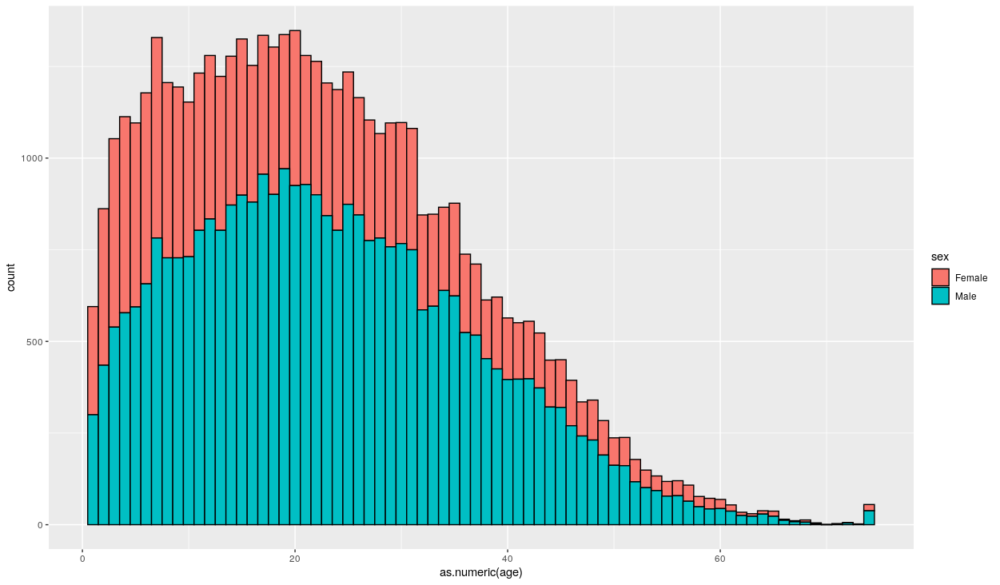

# Data analysis final assignment 2021-1

## 前言

成人数据集来自于 1994 年人口普查数据库，此数据集可在 [UCI Machine Learning Repository](https://archive.ics.uci.edu/ml/datasets/Adult) 中找到。此次作业主要了解如何使用此数据集中的变量来预测个人的年收入是否超过 USD 50K。这个问题的结果是二元的，主要通过 8 种方法进行检查。

------

## 数据集介绍

```text
age：每个样本的工作年龄，为数值型变量；
workclass：工作性质，这里有私人的、当地政府等，为字符型变量；
fnlwgt：是在一个州内，dataset的一个观测代表的人数；
education：每个样本的教育程度；
marital-status：每个样本的婚姻状况，包括未婚、已婚；
occupation：表示每个样本从事的职业；
relationship：每个样本的家庭成员；
race：样本的种族，有黑人和白人；
gender：样本的性别；
capital-gain：样本的税收；
capital-loss：样本的资本损失；
hours-per-week：样本每周工作时长；
native-country：表示样本来自哪个国家；
income：样本的收入，这里的收入有大于50K和小于等于50K
```


-------

## 数据预处理

成人数据集是一个广泛使用的标准机器学习数据集，用于探索和演示许多一般性的或专门为不平衡分类设计的机器学习算法。

总共有 48842 行数据，3620 行含有缺失数据，45222 行具有完整的数据，其中缺失值用`?`标记。有 '>50K' 和 '<=50K' 两类标签数据，也就是说它是一个二分类任务。同时这些标签数据分布不平衡，'<=50K' 类标签相对比重更大。 

具体的载入数据集方法使用 `read.csv` 。由于发现 `adult.data` 与 `adult.test` 中 `native_country` 的 `weight` 值不同，检查后发现两个数据都是完整的因此分别读取 `adult.data` 与 `adult.test` ，并合并后重新划分训练数据集与测试数据集。

```R
adult.temp.train <- read.csv(
  "data/adult/adult.data",
  sep = ",",
  fill = F,
  strip.white = T,
  col.names = c(
    "age", "workclass", "fnlwgt", "education",
    "education_num", "marital_status", "occupation", "relationship", "race", "sex",
    "capital_gain", "capital_loss", "hours_per_week", "native_country", "income"
  )
)
adult.temp.test <- read.csv(
  "data/adult/adult.test",
  sep = ",",
  fill = F,
  strip.white = T,
  col.names = c(
    "age", "workclass", "fnlwgt", "education",
    "education_num", "marital_status", "occupation", "relationship", "race", "sex",
    "capital_gain", "capital_loss", "hours_per_week", "native_country", "income"
  )
)

adult.data <- rbind(adult.temp.train, adult.temp.test)
```

为了简化分析，放弃加权因子，而目标的最高学历可以使用受教育的总年数来替代，而从性别和婚姻状态可以评估家庭关系，所以将会删除 `fnlwgt`, `education`, `relationship`

```R
adult.data$education <- NULL
adult.data$fnlwgt <- NULL
adult.data$relationship <- NULL
```

部分缺失的缺失值使用 `Unknown` 来替代 `?`，顺便删除变量 `i` （强迫症）

```R
adult.int.var <- colnames(adult.data)[which(sapply(adult.data, class) == 'integer')]
adult.fac.var <- colnames(adult.data)[which(sapply(adult.data, class) == 'factor')]
adult.data <- as.data.frame(lapply(adult.data, function(x) ifelse(x == "?", "Unknown", as.character(x))))
for(i in adult.int.var) {
  adult.data[i] <- as.numeric(unlist(adult.data[i]))
}
rm(i)
```

第一个变量 `age` 是一个通过判断可以发现是一个连续变量，因此先画一个按收入划分年龄直方图

```R
ggplot(adult.data) + aes(x=as.numeric(age), group=income, fill=income) + 
  geom_histogram(binwidth=1, color='black')
```

得到


注意到大多数人的收入都是在 `<=50K` ，而在 `>50K` 的人群中集中在职业生涯的中期

顺便再画一个按性别划分年龄直方图

```R
ggplot(adult) + aes(x=as.numeric(age), group=sex, fill=sex) + 
  geom_histogram(binwidth=1, color='black')
```

得到



有趣的是男性的代表数据与女性的不满足 `1:1`，这可能是由人口普查偏差造成的。

```R
summary(adult.data$workclass)
```

```R
#      Federal-gov        Local-gov     Never-worked          Private     Self-emp-inc 
#             1432             3136               10            33905             1695 
# Self-emp-not-inc        State-gov          Unknown      Without-pay 
#             3862             1980             2799               21 
```

`workclass` 变量代表的是阶级注意到有 `Never-worked` 和 `Without-pay` 两类，将他们与 `Unknown` 合并至 `Other/Unknown` ，而在政府工作的值过于细致，因此将其都合并至 `Government` ，最后将那些开公司的合并至 `Self-Employed`

```R
adult.data$workclass <- gsub("^Federal-gov", "Government", adult.data$workclass)
adult.data$workclass <- gsub("^Local-gov", "Government", adult.data$workclass)
adult.data$workclass <- gsub("^State-gov", "Government", adult.data$workclass)
adult.data$workclass <- gsub("^Self-emp-inc", "Self-Employed", adult.data$workclass)
adult.data$workclass <- gsub("^Self-emp-not-inc", "Self-Employed", adult.data$workclass)
adult.data$workclass <- gsub("^Never-worked", "Other", adult.data$workclass)
adult.data$workclass <- gsub("^Without-pay", "Other", adult.data$workclass)
adult.data$workclass <- gsub("^Other", "Other/Unknown", adult.data$workclass)
adult.data$workclass <- gsub("^Unknown", "Other/Unknown", adult.data$workclass)
adult.data$workclass <- as.factor(adult.data$workclass)
```

```R
summary(adult.data$workclass)
```

```R
#    Government Other/Unknown       Private Self-Employed 
#         6548          2830         33905          5557 
```

为了探索收入和阶级之间的关系，计算四种工作类别和两种收入的关系，并以条形图来表示

```R
adult.data.workclass.table <- table(adult.data[adult.data$workclass == 'Government',]$income)["<=50K"]
adult.data.workclass.table <- c(adult.data.workclass.table, table(adult.data[adult.data$workclass == 'Government',]$income)[">50K"])
adult.data.workclass.table <- c(adult.data.workclass.table, table(adult.data[adult.data$workclass == 'Other/Unknown',]$income)["<=50K"])
adult.data.workclass.table <- c(adult.data.workclass.table, table(adult.data[adult.data$workclass == 'Other/Unknown',]$income)[">50K"])
adult.data.workclass.table <- c(adult.data.workclass.table, table(adult.data[adult.data$workclass == 'Private',]$income)["<=50K"])
adult.data.workclass.table <- c(adult.data.workclass.table, table(adult.data[adult.data$workclass == 'Private',]$income)[">50K"])
adult.data.workclass.table <- c(adult.data.workclass.table, table(adult.data[adult.data$workclass == 'Self-Employed',]$income)["<=50K"])
adult.data.workclass.table <- c(adult.data.workclass.table, table(adult.data[adult.data$workclass == 'Self-Employed',]$income)[">50K"])
adult.data.workclass.table <- as.numeric(adult.data.workclass.table)
adult.data.workclass.industry <- rep(levels(adult.data$workclass), each = 2)
adult.data.workclass.income <- rep(c('<=50K', '>50K'), 4)
adult.data.workclass.df <- data.frame(adult.data.workclass.industry, adult.data.workclass.income, adult.data.workclass.table)
print(adult.data.workclass.df)
```

```R
#   adult.data.workclass.industry adult.data.workclass.income adult.data.workclass.table
# 1                    Government                       <=50K                       4530
# 2                    Government                        >50K                       2018
# 3                 Other/Unknown                       <=50K                       2563
# 4                 Other/Unknown                        >50K                        267
# 5                       Private                       <=50K                      26518
# 6                       Private                        >50K                       7387
# 7                 Self-Employed                       <=50K                       3542
# 8                 Self-Employed                        >50K                       2015
```

```R
adult.data.workclass.df <- ddply(adult.data.workclass.df, .(adult.data.workclass.industry), transform, percent = adult.data.workclass.table/sum(adult.data.workclass.table) * 100)
adult.data.workclass.df <- ddply(adult.data.workclass.df, .(adult.data.workclass.industry), transform, pos = (cumsum(adult.data.workclass.table) - 0.5 * adult.data.workclass.table))
adult.data.workclass.df$label <- paste0(sprintf("%.0f", adult.data.workclass.df$percent), "%")
ggplot(adult.data.workclass.df, aes(x = adult.data.workclass.industry, y = adult.data.workclass.table, fill = adult.data.workclass.income)) +
  geom_bar(stat = "identity") +
  geom_text(aes(y = pos, label = label), size = 3, position=position_stack(vjust = 0)) + 
  ggtitle('Income by Industry')
```


可以看出商人的收入 `>50K` 居多

同理对 `education_num` 进行处理

```R
adult.data.education.df <- data.frame(table(adult.data$income, adult.data$education_num))
names(adult.data.education.df) <- c('income', 'education_num', 'count')
adult.data.education.df <- ddply(adult.data.education.df, .(education_num), transform, percent = count/sum(count) * 100)
adult.data.education.df <- ddply(adult.data.education.df, .(education_num), transform, pos = (cumsum(count) - 0.5 * count))
adult.data.education.df$label <- paste0(sprintf("%.0f", adult.data.education.df$percent), "%")
print(adult.data.education.df)
ggplot(adult.data.education.df, aes(x = education_num, y = count, fill = income)) +
  geom_bar(stat = "identity") +
  geom_text(aes(y = pos, label = label), size = 2, position=position_stack(vjust = 0)) + 
  ggtitle('Income Level with Years of Education')

```

得到


我们不难发现，随着受教育年限的增加，年收入超过 50K USD 的群体比例也在增加。 对于没有任何形式的大学教育（少于或等于 8 年教育）的人，年收入超过 50K USD 的不到 10%。 而对于拥有博士学位的人来说，近四分之三的人年收入超过 50K USD。

接下来开始分析职业对收入的影响

```R
summary(adult.data$occupation)
```

```R
#      Adm-clerical      Armed-Forces      Craft-repair   Exec-managerial   Farming-fishing 
#              5610                15              6112              6086              1490 
# Handlers-cleaners Machine-op-inspct     Other-service   Priv-house-serv    Prof-specialty 
#              2072              3021              4923               242              6172 
#   Protective-serv             Sales      Tech-support  Transport-moving           Unknown 
#               983              5504              1446              2355              2809
```

为了简化模型，我们将职业分为蓝领、专业、销售、服务和白领。由于 `Armed-Forces` 人数较少，他们与未知数组合形成 `Other/Unknown`

```R
adult.data$occupation <- gsub("Adm-clerical", "White-Collar", adult.data$occupation)
adult.data$occupation <- gsub("Craft-repair", "Blue-Collar", adult.data$occupation)
adult.data$occupation <- gsub("Exec-managerial", "White-Collar", adult.data$occupation)
adult.data$occupation <- gsub("Farming-fishing", "Blue-Collar", adult.data$occupation)
adult.data$occupation <- gsub("Handlers-cleaners", "Blue-Collar", adult.data$occupation)
adult.data$occupation <- gsub("Machine-op-inspct", "Blue-Collar", adult.data$occupation)
adult.data$occupation <- gsub("Other-service", "Service", adult.data$occupation)
adult.data$occupation <- gsub("Priv-house-serv", "Service", adult.data$occupation)
adult.data$occupation <- gsub("Prof-specialty", "Professional", adult.data$occupation)
adult.data$occupation <- gsub("Protective-serv", "Service", adult.data$occupation)
adult.data$occupation <- gsub("Tech-support", "Service", adult.data$occupation)
adult.data$occupation <- gsub("Transport-moving", "Blue-Collar", adult.data$occupation)
adult.data$occupation <- gsub("Unknown", "Other/Unknown", adult.data$occupation)
adult.data$occupation <- gsub("Armed-Forces", "Other/Unknown", adult.data$occupation)
adult.data$occupation <- as.factor(adult.data$occupation)
summary(adult.data$occupation)
```

```R
#  Blue-Collar Other/Unknown  Professional         Sales       Service  White-Collar 
#        15050          2824          6172          5504          7594         11696
```

下面开始分析收入与职业的关系

```R
adult.data.occupation.df <- data.frame(table(adult.data$income, adult.data$occupation))
names(adult.data.occupation.df) <- c('income', 'occupation', 'count')
adult.data.occupation.df <- ddply(adult.data.occupation.df, .(occupation), transform, percent = count/sum(count) * 100)
adult.data.occupation.df <- ddply(adult.data.occupation.df, .(occupation), transform, pos = (cumsum(count) - 0.5 * count))
adult.data.occupation.df$label <- paste0(sprintf("%.0f", adult.data.occupation.df$percent), "%")
print(adult.data.occupation.df)
ggplot(adult.data.occupation.df, aes(x = occupation, y = count, fill = income)) +
  geom_bar(stat = "identity") +
  geom_text(aes(y = pos, label = label), size = 2, position=position_stack(vjust = 0)) + 
  ggtitle('Income Level with Different Occupations')
```

得到

```R
#    income    occupation count   percent     pos label
# 1   <=50K   Blue-Collar 12503 83.076412  6251.5   83%
# 2    >50K   Blue-Collar  2547 16.923588 13776.5   17%
# 3   <=50K Other/Unknown  2554 90.439093  1277.0   90%
# 4    >50K Other/Unknown   270  9.560907  2689.0   10%
# 5   <=50K  Professional  3388 54.893065  1694.0   55%
# 6    >50K  Professional  2784 45.106935  4780.0   45%
# 7   <=50K         Sales  4029 73.201308  2014.5   73%
# 8    >50K         Sales  1475 26.798692  4766.5   27%
# 9   <=50K       Service  6659 87.687648  3329.5   88%
# 10   >50K       Service   935 12.312352  7126.5   12%
# 11  <=50K  White-Collar  8020 68.570451  4010.0   69%
# 12   >50K  White-Collar  3676 31.429549  9858.0   31%
```


值得注意的是，不同职业的收入差异很大。 近一半的专业职业的年收入超过 50K USD，而服务职业的这一比例仅为 12%。

`marital_status` 是一个分类变量有 7 个类别，以婚姻状况，它也可以分为几类。

```R
summary(adult.data$marital_status)
```

```R
#             Divorced     Married-AF-spouse    Married-civ-spouse Married-spouse-absent 
#                 6633                    37                 22379                   628 
#        Never-married             Separated               Widowed 
#                16115                  1530                  1518 
```

```R
adult.data$marital_status <- gsub("Married-AF-spouse", "Married", adult.data$marital_status)
adult.data$marital_status <- gsub("Married-civ-spouse", "Married", adult.data$marital_status)
adult.data$marital_status <- gsub("Married-spouse-absent", "Married", adult.data$marital_status)
adult.data$marital_status <- gsub("Never-married", "Single", adult.data$marital_status)
adult.data$marital_status <- as.factor(adult.data$marital_status)
summary(adult.data$marital_status)
```

```R
#  Divorced   Married Separated    Single   Widowed 
#      6633     23044      1530     16115      1518
```

开始分析家庭状况与职业的关系

```R
adult.data.marital.df <- data.frame(table(adult.data$income, adult.data$marital_status))
names(adult.data.marital.df) <- c('income', 'marital_status', 'count')
adult.data.marital.df <- ddply(adult.data.marital.df, .(marital_status), transform, percent = count/sum(count) * 100)
adult.data.marital.df <- ddply(adult.data.marital.df, .(marital_status), transform, pos = (cumsum(count) - 0.5 * count))
adult.data.marital.df$label <- paste0(sprintf("%.0f", adult.data.marital.df$percent), "%")
print(adult.data.marital.df)
ggplot(adult.data.marital.df, aes(x = marital_status, y = count, fill = income)) +
  geom_bar(stat = "identity") +
  geom_text(aes(y = pos, label = label), size = 2, position=position_stack(vjust = 0)) + 
  ggtitle('Income Level with Marital Status')
```

```R
#    income marital_status count   percent     pos label
# 1   <=50K       Divorced  5962 89.883914  2981.0   90%
# 2    >50K       Divorced   671 10.116086  6297.5   10%
# 3   <=50K        Married 12988 56.361743  6494.0   56%
# 4    >50K        Married 10056 43.638257 18016.0   44%
# 5   <=50K      Separated  1431 93.529412   715.5   94%
# 6    >50K      Separated    99  6.470588  1480.5    6%
# 7   <=50K         Single 15382 95.451443  7691.0   95%
# 8    >50K         Single   733  4.548557 15748.5    5%
# 9   <=50K        Widowed  1390 91.567852   695.0   92%
# 10   >50K        Widowed   128  8.432148  1454.0    8%
```


不管是否结婚，大多的人收入都在 50K USD 之下

下面看看人种


可以发此次的调查中主要以白种人为主

```R
summary(adult.data)
```

```R
#      age                workclass     education_num      marital_status          occupation   
# Min.   : 1.00   Government   : 6548   Min.   : 1.000   Divorced : 6633   Blue-Collar  :15050  
# 1st Qu.:12.00   Other/Unknown: 2830   1st Qu.: 3.000   Married  :23044   Other/Unknown: 2824  
# Median :21.00   Private      :33905   Median : 6.000   Separated: 1530   Professional : 6172  
# Mean   :22.64   Self-Employed: 5557   Mean   : 8.882   Single   :16115   Sales        : 5504  
# 3rd Qu.:32.00                         3rd Qu.:16.000   Widowed  : 1518   Service      : 7594  
# Max.   :74.00                         Max.   :16.000                     White-Collar :11696  
#                                                                                               
#                 race           sex         capital_gain      capital_loss    hours_per_week 
# Amer-Indian-Eskimo:  470   Female:16192   Min.   :  1.000   Min.   : 1.000   Min.   : 1.00  
# Asian-Pac-Islander: 1519   Male  :32648   1st Qu.:  1.000   1st Qu.: 1.000   1st Qu.:35.00  
# Black             : 4684                  Median :  1.000   Median : 1.000   Median :35.00  
# Other             :  406                  Mean   :  6.951   Mean   : 2.948   Mean   :36.08  
# White             :41761                  3rd Qu.:  1.000   3rd Qu.: 1.000   3rd Qu.:40.00  
#                                           Max.   :123.000   Max.   :99.000   Max.   :96.00  
#                                                                                             
#       native_country    income     
# United-States:43830   <=50K:37153  
# Mexico       :  951   >50K :11687  
# Unknown      :  857                
# Philippines  :  295                
# Germany      :  206                
# Puerto-Rico  :  184                
# (Other)      : 2517 
```


